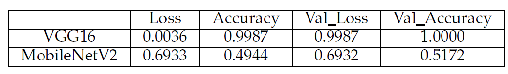
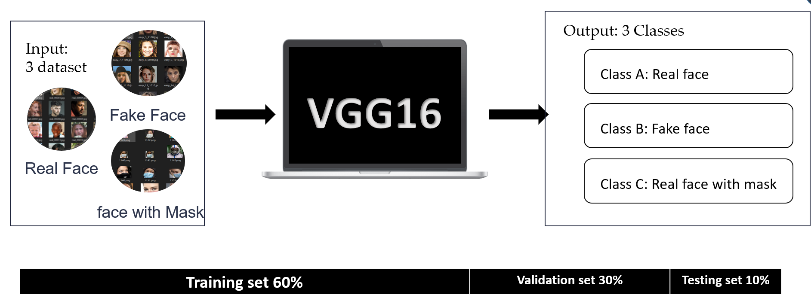
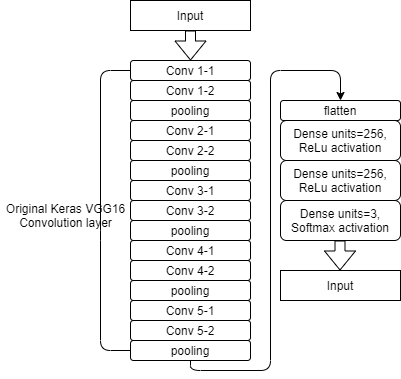
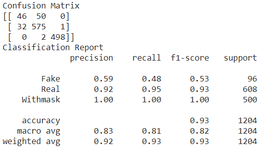
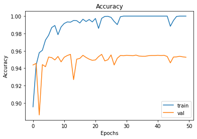
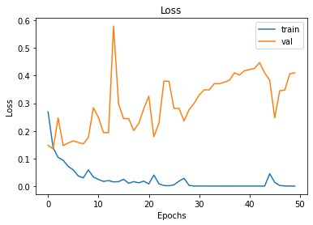
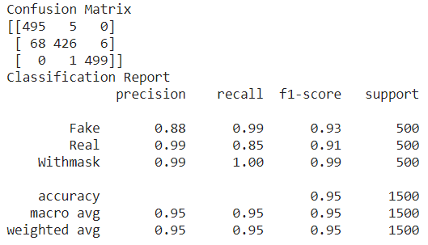

# The-Combination-between-Two-DataSets-and-Two-Models
Project of Machine Learning course in KSU

I built a Convolution neural network (CNN) model based on existing models, which I picked up on the Kaggle website.

**Model:**
First, VGG16
[U. S. Michael Macht New York New York, “mask detection, visualization,” 2021](https://www.kaggle.com/michaelcripman/maskdetection-visualization)

Second, MobileNet
[M. Matta, “real vs fake face,” 2019](https://www.kaggle.com/martin1234567890/real-vs-fake-face)

**Database:**
First, face masks dataset
[S. a. L. K. H. I. Ashish Jangra, “Face mask 12k images dataset,” 2020](https://www.kaggle.com/ashishjangra27/facemask-12k-images-dataset/metadata)

Second, Real and Fake human face dataset
[C. Intelligence and K. Photography Lab, Department of Computer Science Yonsei University, “Real and fake face detection,”2019](https://www.kaggle.com/ciplab/real-and-fake-facedetection/metadata)

I didn't build the CNN classifier from the scratch. but from other's and did some modification.

The models were originally built for two-class classifiers, and I hoped to build a three-class classifier.

After implementing the original model, it was found that the results of MobileNet did not match the results on the kaggle website.

Therefore, I chose to build the new model based on the first model, and modify something.

The concept was,

The final model was,

****Result****
First result, is VGG16 with unbalance dataset a) Accuracy b) Loss c) Classification Report of test
a) 

b) 

c) 

Second result, is VGG16 with balance dataset a) Accuracy b) Loss c) Classification Report of test
a) 

b) 

c) 

Third result, is VGG16 with balance dataset with some parameters modification. a) Accuracy b) Loss c) Classification Report of test
a) 

b) 

c) 

