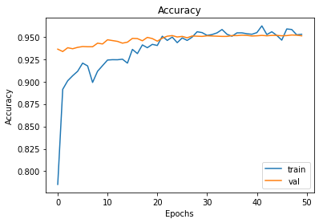
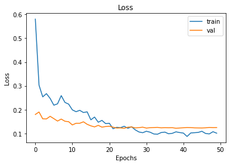
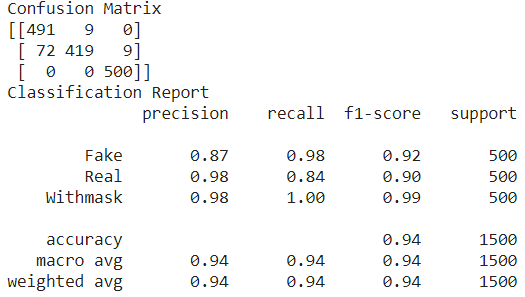

# The-Combination-between-Two-DataSets-and-Two-Models
Project of Machine Learning course in KSU

I built a Convolution neural network (CNN) model based on existing models, which I picked up on the Kaggle website.

**Model:**
First, VGG16
[U. S. Michael Macht New York New York, “mask detection, visualization,” 2021](https://www.kaggle.com/michaelcripman/maskdetection-visualization)

Second, MobileNet
[M. Matta, “real vs fake face,” 2019](https://www.kaggle.com/martin1234567890/real-vs-fake-face)

**Database:**
First, face masks dataset
[S. a. L. K. H. I. Ashish Jangra, “Face mask 12k images dataset,” 2020](https://www.kaggle.com/ashishjangra27/facemask-12k-images-dataset/metadata)

Second, Real and Fake human face dataset
[C. Intelligence and K. Photography Lab, Department of Computer Science Yonsei University, “Real and fake face detection,”2019](https://www.kaggle.com/ciplab/real-and-fake-facedetection/metadata)

I didn't build the CNN classifier from the scratch. but from other's and did some modification.

The models were originally built for two-class classifiers, and I hoped to build a three-class classifier.

After implementing the original model, it was found that the results of MobileNet did not match the results on the kaggle website.

Therefore, I chose to build the new model based on the first model, and modify something.

The concept was,

The final model was,

****Result****

First result, is VGG16 with unbalance dataset a) Accuracy b) Loss c) Classification Report of test

a) 

b) 

c) 

Second result, is VGG16 with balance dataset a) Accuracy b) Loss c) Classification Report of test

a) 

b) 

c) 

Third result, is VGG16 with balance dataset with some parameters modification. a) Accuracy b) Loss c) Classification Report of test

a) 

b) 

c) 

**Comclusion**

We did not focus on deeper or newer information, but wider concept of CNN machine learning. About the two main purposes: First, we understand that balanced and unbalanced dataset will influence the test f1-score, due to the difference size of the sample in each classes. Second, for a new question, which is three categorical classification problem in this article, we cannot just built a model exactly the same as the existing model, but still need to change some parameters. After that, we can possible get a model that meets the minimum require, that might give us a brief first sight of a new problem. When we look for the same module, we should not look for similar data sets, but for similar problems. That is, for instance, in this article, if I want to seek for the models suitable for my project, we should find “multiple classification problems”, instead of finding model for “face binary classification problem”.

To summarize, we did learn a lot of knowledge about machine learning, especially on CNN-based model, and got the answer for those questions, which are the purpose of this article.

